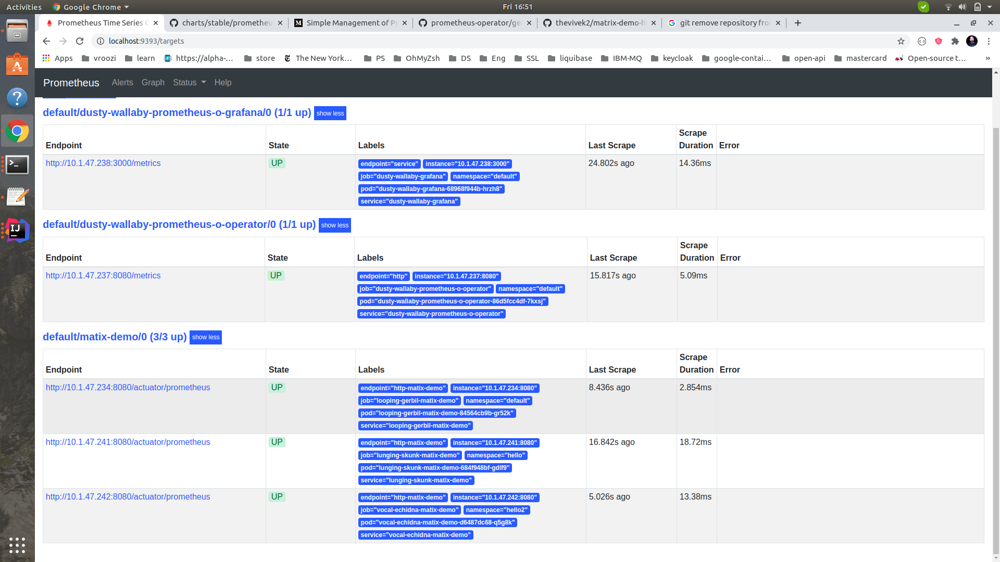
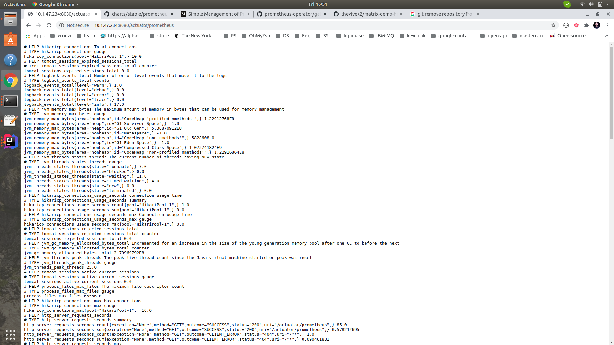
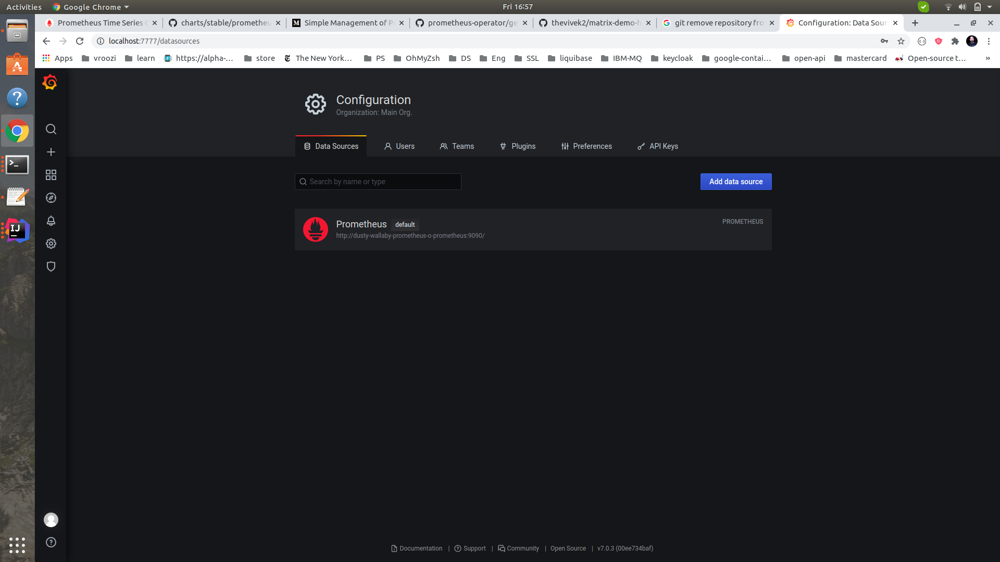

# prometheus for application service

1. Run matrix demo application using helm chart. Most of the services are disabled, we are looking for /actuator/prometheus scrap from application. 
   helm install stable/prometheus-operator -f config.yaml --namespace=monitoring
  
  ---
    alertmanager:
      enabled: false
    coreDns:
      enabled: false
    kubeApiServer:
      enabled: false
    kubeControllerManager:
      enabled: false
    kubeDns:
      enabled: false
    kubeEtcd:
      enabled: false
    kubeProxy:
      enabled: false
    kubeScheduler:
      enabled: false
    kubeStateMetrics:
      enabled: false
    kubelet:
      enabled: false
    nodeExporter:
      enabled: false
     additionalServiceMonitors:
       - name: "matix-demo"
         selector: {}
         namespaceSelector:
           any: false
           matchNames:
             - test1
             - test2
         endpoints:
           - port: http-matix-demo
             targetPort: 8080
             path: /actuator/prometheus
             scheme: http
  ---
   
   Above, additional service monitor is added to discover service into test1, test2 namespace 
   endpoint path to scrap is /actuator/prometheus
    
   This will run the promethus and grafana, since it has been enabled.
    
2. let's install application to namespace test1 and test2, which has /actuator/prometheus exposed. 
 
  ---
      git clone https://github.com/thevivek2/matrix-demo-helm-chart 
       
       helm install matrix-demo-helm-chart --namespace test1
      
      kubectl get pods
      NAME                                                   READY   STATUS    RESTARTS   AGE
      dusty-wallaby-grafana-68968f944b-hrzh8                 2/2     Running   0          34m
      dusty-wallaby-prometheus-o-operator-86d5fcc4df-7kxsj   2/2     Running   0          34m
      looping-gerbil-matix-demo-84564cb9b-gr52k              1/1     Running   0          36m
      prometheus-dusty-wallaby-prometheus-o-prometheus-0     3/3     Running   1          34m
     
      kubectl port-forward svc/dusty-wallaby-prometheus-o-prometheus 9393:9090
      Forwarding from 127.0.0.1:9393 -> 9090
      Forwarding from [::1]:9393 -> 9090
   ---
 ---
 
 
3. Access the prometheus web, check the target/Service discovery, you would find scrapping information.

   http://localhost:9393/targets

   
   
   
   
4. to access grafana Grafana
 
  kubectl port-forward svc/dusty-wallaby-grafana 7777:80
  Forwarding from 127.0.0.1:7777 -> 3000
  Forwarding from [::1]:7777 -> 3000

  user : admin
  password : prom-operator
  
  
   
  
  
Reference:
https://github.com/helm/charts/tree/master/stable/prometheus-operator
https://github.com/thevivek2/matrix-demo-helm-chart
https://github.com/thevivek2/prometheus-operator-config
https://github.com/thevivek2/matrix-demo
